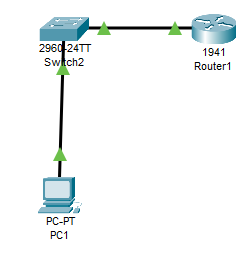

# Integrador_DarknessGym

## Integrantes

- Ricardo Lopez Cruz (230110088)  
- Alejandro Cruz Martínez (230110322)  
- Karen Perez Ortiz (230110326)  
- Santiago Reséndiz Melanie (230110616)  
- Gustavo López Paz (230110531)  

---

## Planteamiento del Problema

El gimnasio *Darkness Gym* enfrenta desafíos significativos debido a la falta de un sistema centralizado para la gestión de membresías y pagos. Actualmente, los procesos se realizan de manera manual, lo que genera ineficiencias, errores en el registro de clientes y dificultades en el seguimiento de los pagos y vencimientos de membresías.

---

## Objetivo General

Desarrollar un sistema automatizado para el gimnasio **Darkness Gym** que permita administrar de forma eficiente las membresías de los clientes, incluyendo el registro de pagos, el control de mensualidades y el envío de notificaciones automáticas antes del vencimiento. Este sistema se implementará en un software utilizando el modelo MVC de ASP.NET, con una base de datos segura accesible mediante ODBC. Además, se aplicarán medidas de seguridad en redes para proteger la información de los usuarios y garantizar la integridad del sistema.

---

## Objetivos Específicos de la Materia

- Diseñar una red de área local (LAN) mediante subnetting, utilizando el rango `172.16.0.0/27`, para segmentar correctamente la red del gimnasio en al menos cinco subredes funcionales.
- Implementar un servidor central con sistema operativo **Windows 10**, que actúe como nodo principal de la red.
- Instalar y configurar en el servidor las herramientas necesarias para el funcionamiento del sistema:
  - **SQL Server Management Studio 2019** para la gestión de la base de datos.
  - **ASP.NET MVC 8** para la ejecución del sistema web bajo el patrón Modelo-Vista-Controlador.
- Establecer medidas de seguridad básicas en la red para proteger la comunicación entre dispositivos y asegurar la integridad de la información almacenada.

---

## Desarrollo

Se creará una red de forma local (LAN) destinada a segmentar de manera ordenada las conexiones internas del grupo de TICs 4B, el cual requiere dividir direcciones IP entre 5 equipos. Para lograr esto de forma eficiente, se aplicará el proceso de **subnetting**, con el objetivo de asignar el espacio de direcciones disponible de forma equitativa y optimizada.


### IPv4: Subnetting

Partimos de una red base:
192.168.0.0/24


La cual posee un total de **256 direcciones IP**. Para dividir estas direcciones entre 5 grupos sin desperdiciarlas, se aplicará **VLSM (Variable Length Subnet Masking)**.

#### Cálculo de Hosts:

Fórmula:  
`2^n ≥ número de hosts requeridos`

- `2² = 4` → Insuficiente  
- `2³ = 8` → Adecuado  

Entonces, **n = 3**, lo que nos da **8 direcciones por subred**, de las cuales **6 son utilizables**.

Nueva máscara de subred:
/24 + 3 = /27 → 255.255.255.224




Para calcular las direcciones de **red** y **broadcast**, se sigue este principio:

- La **dirección de red** se obtiene **poniendo en 0 todos los bits de la parte de host**.
- La **dirección de broadcast** se obtiene **poniendo en 1 todos los bits de la parte de host**.

Esto permite definir los rangos válidos de direcciones IP utilizables dentro de una subred específica.

---
#### Dirección de red

Ponemos en **0** la parte del host para obtener la dirección de red:

| Posición de bits  | 24  | 25  | 26  | 27  | 28 | 29 | 30 | 31 |
|-------------------|-----|-----|-----|-----|----|----|----|----|
| Valor del bit     | 128 |  64 |  32 |  16 |  8 |  4 |  2 |  1 |
| Bits utilizados   |  0  |  0  |  0  |  0  |  0 |  0 |  0 |  0 |

🔹 **Resultado:** `192.168.0.0` → Esta dirección **identifica la subred** y **no se puede asignar a un host**.

---

#### Dirección de broadcast

Ponemos en **1** la parte del host para obtener la dirección de broadcast:

| Posición de bits  | 24  | 25  | 26  | 27  | 28 | 29 | 30 | 31 |
|-------------------|-----|-----|-----|-----|----|----|----|----|
| Valor del bit     | 128 |  64 |  32 |  16 |  8 |  4 |  2 |  1 |
| Bits utilizados   |  0  |  0  |  0  |  1  |  1 |  1 |  1 |  1 |

🔹 **Resultado:** `192.168.0.31` → Esta es la **última dirección de la subred** y tampoco se puede asignar a un host.


#### Primera Subred:

- Dirección de red: `192.168.0.0`
- Primer host válido: `192.168.0.1`
- Último host válido: `192.168.0.30`
- Dirección de broadcast: `192.168.0.31`

IPs utilizables:  
`192.168.0.1` → `192.168.0.30`

Estas direcciones serán utilizadas por los dispositivos del equipo.

---

### IPv6


A diferencia del direccionamiento IPv4, el protocolo IPv6 permite una asignación más flexible y eficiente de direcciones IP gracias a su espacio extendido y mecanismos de autoconfiguración, como EUI-64.    
    
Para nuestro proyecto, optamos por utilizar asignación automática de direcciones mediante EUI-64, ya que reduce la carga administrativa y garantiza unicidad a partir de la dirección MAC de cada dispositivo. Esta técnica se implementa fácilmente en entornos LAN y facilita la configuración de nodos.
    
#### Tipos de Direcciones IPv6 en Redes LAN

| Tipo de dirección | Descripción                          | Ejemplo               |
|-------------------|--------------------------------------|------------------------|
| GUA               | Global Unicast Address (red pública) | 2001:db8:1:1::/64      |
| LLA               | Link-Local Address (uso interno local) | FE80::/10            |
| EUI-64            | Dirección autogenerada a partir de la MAC | Basada en prefijo como 2001:db8:1:a::/64 |

Ejemplo de Configuración IPv6    
1. Dirección Asignada Automáticamente (EUI-64)    
Prefijo utilizado: 2001:db8:1:a::/64
Dirección generada automáticamente a partir de la MAC
```bash
interface g0/1
ipv6 address 2001:db8:1:a::/64 eui-64
ipv6 enable
```
Esta configuración permite que el dispositivo genere su dirección completa combinando el prefijo con su MAC, sin necesidad de intervención manual.    

2. Dirección Asignada Manualmente    
En contraste, también se puede asignar una dirección estática para un nodo específico, útil por ejemplo en un servidor o router principal donde se requiere una IP fija conocida.
```bash
interface g0/1
ipv6 address 2001:db8:1:a::1/64
ipv6 enable
```    
Esta dirección fue asignada de forma manual, por lo que se debe asegurar que no entre en conflicto con otras direcciones del mismo prefijo.

---

### Configuración del Router

Estos comandos habilitan el enrutamiento IPv6, configuran una interfaz con direcciones IPv4 e IPv6, tanto manual como automática, y preparan el router para conectarse a la LAN.

```bash
enable
configure terminal
ipv6 unicast-routing              # Habilita el enrutamiento IPv6

interface g0/1                    # Accede a la interfaz GigabitEthernet 0/1
ip address 172.16.0.1 255.255.255.224

ipv6 address 2001:db8:1:2::/64 eui-64        # Dirección IPv6 autogenerada (EUI-64)
ipv6 address 2001:db8:1:2::1/64              # <-! Esto es de forma manual
ipv6 address enable                          # <-! Esto es de forma automática 
ipv6 enable

no shutdown
description "to LAN"
exit
```

### Configuración del Router
Se configura la VLAN 1 para administración, con direccionamiento IPv4 e IPv6. También se activan los puertos en modo acceso.

```bash
enable
conf t

interface vlan 1
ip address 172.16.0.2 255.255.255.224
ipv6 address 2001:db8:1:2::/64 eui-64
ipv6 enable                                   # <-! Esto es de forma automática
no shutdown
description "to Admin"
exit

interface range fa0/1
switchport mode access
switchport access vlan 1
exit
```
