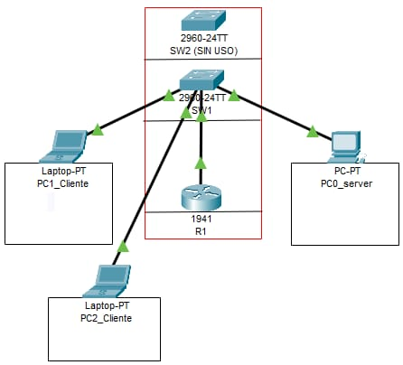

# Integrador_DarknessGym

# Proyecto Integrador – Darkness Gym

### Reporte Técnico

**Nombre del Proyecto:**  
Sistema de Administración para Darkness Gym

**Autores:**  
- Ricardo López Cruz  
- Alejandro Cruz Martínez  
- Karen Pérez Ortiz  
- Melanie Santiago Reséndiz  
- Gustavo López Paz  

**Fecha de entrega:**  
28 de mayo de 2025

**Institución:**  
Instituto Tecnológico Superior del Occidente del Estado de Hidalgo

---

## II.Índice

## Índice

1. [Reporte Técnico](#reporte-técnico)
   - [I. Portada](#i-portada)
   - [II. Índice](#ii-índice)
   - [III. Resumen Ejecutivo](#iii-resumen-ejecutivo)
   - [IV. Introducción](#iv-introducción)
   - [V. Descripción de la Problemática y la Organización](#v-descripción-de-la-problemática-y-la-organización)
   - [VI. Requerimientos de la Organización con Respecto a la Red](#vi-requerimientos-de-la-organización-con-respecto-a-la-red)
   - [VII. Descripción y Justificación de Topología Física y Lógica](#vii-descripción-y-justificación-de-topología-física-y-lógica)
   - [VIII. Listado de Protocolos y Estándares Empleados](#viii-listado-de-protocolos-y-estándares-empleados)
   - [IX. Descripción de Esquema de Direccionamiento IPv4 o IPv6](#ix-descripción-de-esquema-de-direccionamiento-ipv4-o-ipv6)
   - [X. Descripción de la Implementación de Seguridad en los Equipos de Red](#x-descripción-de-la-implementación-de-seguridad-en-los-equipos-de-red)
   - [XI. Descripción de las Configuraciones Básicas en los Equipos de Red](#xi-descripción-de-las-configuraciones-básicas-en-los-equipos-de-red)
   - [XII. Pruebas de Conectividad de la Red](#xii-pruebas-de-conectividad-de-la-red)
   - [XIII. Inventario de Equipos de Red](#xiii-inventario-de-equipos-de-red)
   - [XIV. Resultados](#xiv-resultados)
   - [XV. Trabajos Futuros](#xv-trabajos-futuros)
   - [XVI. Conclusiones](#xvi-conclusiones)

---

## III. Resumen Ejecutivo

El presente proyecto integrador tiene como finalidad desarrollar un sistema automatizado para el gimnasio **Darkness Gym**, con el propósito de mejorar la administración de clientes, membresías y pagos, reduciendo errores manuales y centralizando el control operativo.  

Para su implementación se diseñó una **red LAN** mediante **subnetting**, utilizando el bloque de red `172.16.0.0/27`, garantizando conectividad interna y segmentación lógica. El sistema fue desarrollado como una aplicación web bajo el patrón **MVC** en **ASP.NET**, conectado a una base de datos relacional en **SQL Server**.  

Se aplicó la metodología ágil **SCRUM**, dividiendo el proyecto en cinco sprints que incluyeron análisis de requerimientos, documentación, modelado, pruebas y presentación final.  

Los resultados obtenidos confirman que el sistema es funcional, escalable y adecuado para las necesidades del gimnasio. Se logró una red segura, una aplicación web estable y un modelo de base de datos eficiente. Este trabajo integra conocimientos de programación, bases de datos, redes, arquitectura de computadoras e ingeniería de software.

---

## IV. Introducción

El proyecto integrador titulado **"Sistema de Administración para Darkness Gym"** tiene como propósito optimizar el manejo de membresías, pagos y clientes en un gimnasio local mediante tecnologías modernas de programación, redes y bases de datos.

La relevancia de este proyecto se extiende a sectores como la **educación**, al aplicar conocimientos adquiridos en distintas asignaturas; a la **industria y el comercio**, por ofrecer una solución tecnológica viable a pequeñas empresas; e incluso a nivel **social**, al facilitar el acceso a sistemas organizados que mejoran la atención al cliente.

En la actualidad, muchas microempresas enfrentan dificultades por falta de herramientas tecnológicas adaptadas a sus necesidades. Por ello, desarrollar una solución a medida, con infraestructura de red y sistema web funcional, contribuye no solo a la digitalización de procesos, sino también al fortalecimiento de la gestión operativa, sirviendo como modelo replicable para otros negocios similares.

---

## V. Descripción de la problemática y la organización

La organización **Darkness Gym** es un gimnasio local que opera sin herramientas tecnológicas de gestión. Su sistema actual se basa en registros manuales, lo que provoca errores en el seguimiento de pagos, duplicación de datos, pérdida de información y poca visibilidad del estado de las membresías de los clientes.

En cuanto al área de **redes de computadoras**, el gimnasio no cuenta con una infraestructura local (LAN) definida ni con segmentación adecuada para asegurar una comunicación ordenada entre dispositivos.

La falta de conectividad estructurada impide el funcionamiento de un sistema web interno y restringe la automatización de procesos clave. Esto genera un impacto negativo en la eficiencia administrativa, la satisfacción del cliente y la capacidad del negocio para crecer o adaptarse.

A través de este proyecto, se propone implementar una **red LAN segmentada mediante subnetting**, estableciendo conexiones entre un servidor, dispositivos de administración y los nodos necesarios para que el sistema funcione localmente con seguridad y eficiencia.

---

## VI. Requerimientos de la organización con respecto a la red

Con base en el análisis de la situación actual del gimnasio **Darkness Gym** y los objetivos del sistema, se identificaron los siguientes requerimientos para diseñar una red LAN funcional, segura y adaptada a las necesidades reales del proyecto.

| Requerimiento de red     | Descripción                                                                                  |
|--------------------------|----------------------------------------------------------------------------------------------|
| **Ancho de banda**       | Se requiere un ancho de banda mínimo de **100 Mbps** para asegurar comunicación fluida entre los dispositivos conectados localmente. Esto permite al administrador trabajar en tiempo real con el sistema web y la base de datos sin interrupciones. |
| **Cantidad de dispositivos** | La red utilizará **una única subred** con **30 direcciones IP válidas** (de `192.168.0.1` a `192.168.0.30`). Esto permite conectar todos los dispositivos necesarios: servidor, router, switch y PC del administrador. |
| **Topología**            | Se empleará una **topología en estrella**, donde todos los dispositivos se conectan a un switch central. Esto facilita el mantenimiento, la escalabilidad y el control de tráfico. |
| **Direccionamiento IP**  | Se asignarán **IPs estáticas dentro del rango `192.168.0.1 - 192.168.0.30`**, asegurando control total sobre los dispositivos y evitando conflictos. |
| **Compatibilidad IPv6**  | Se implementará soporte para **IPv6** con direcciones generadas automáticamente usando **EUI-64**, facilitando la autoconfiguración de dispositivos modernos. |
| **Seguridad básica**     | Se aplicarán configuraciones de seguridad en el router y switch: **contraseñas cifradas**, acceso restringido mediante **SSH y Telnet**, y **banners de advertencia**. |
| **Autonomía local**      | La red funcionará de manera **totalmente local (LAN)**, sin necesidad de conexión a Internet. Esto garantiza disponibilidad continua del sistema incluso en caso de fallas externas. |

Con esta configuración, Darkness Gym contará con una red eficiente, segura y preparada para alojar el sistema de gestión desarrollado específicamente para sus necesidades.

---


## Planteamiento del Problema

El gimnasio *Darkness Gym* enfrenta desafíos significativos debido a la falta de un sistema centralizado para la administración de membresías y pagos; los procesos se realizan de manera manual, lo que genera ineficiencias, errores en el registro de clientes y dificultades en el seguimiento de los pagos y vencimientos de membresías.

---

## Objetivo General

Desarrollar un sistema automatizado para el gimnasio "Darkness Gym" que permita administrar de forma eficiente las membresías de los clientes, incluyendo el registro de pagos y el control de mensualidades, utilizando una base de datos central gestionada desde interfaces web.

---

## Objetivos Específicos
-	Recolectar y analizar los requerimientos del cliente mediante entrevistas directas con el personal de "Darkness Gym", con el fin de identificar las necesidades clave de gestión, como el control de pagos, membresías.

-	Diseñar y construir una base de datos segura y estructurada, para almacenar información crítica como datos de clientes, pagos, fechas de vencimiento y membresías, garantizando integridad y acceso eficiente usando un manejado de base de datos.

-	Desarrollar una aplicación web funcional bajo el modelo MVC en ASP.NET, que permita registrar pagos, visualizar el estado de membresías y enviar notificaciones antes del vencimiento, asegurando así una experiencia de usuario intuitiva y automatizada.

-	Diseñar una red LAN, para la implementación de la aplicación web , aplicandp medidas básicas de seguridad para proteger la información.


# Objetivos Específicos de la Materia de REDES

- Diseñar una red de área local (LAN) mediante subnetting del bloque 172.16.0.0/24, aplicando una máscara /27,
para distribuir de forma eficiente el direccionamiento IP entre al menos cinco subredes funcionales.

- Configurar una red LAN con direccionamiento estático utilizando comandos de consola,
para establecer control manual de los dispositivos y aplicar medidas básicas de seguridad como SSH, banners de acceso y encriptación de contraseñas, evitando accesos no autorizados.

- Asignar direcciones IPv6 a los dispositivos utilizando el método EUI-64 y dirección manual,
para asegurar compatibilidad con redes modernas y facilitar la autoconfiguración de nodos internos.

- Configurar el router, switch y estaciones de trabajo con comandos adecuados y pruebas de conectividad (ping, show ip),
para validar la operatividad de la red y garantizar comunicación estable entre los equipos.

- Implementar un servidor local con sistema operativo Windows 10, que aloje la aplicación web desarrollada en ASP.NET MVC 8 con SQL Server,
para permitir el acceso al sistema de gestión de Darkness Gym dentro de la red LAN, sin depender de servicios en la nube.

---

## VII. Descripción y justificación de la topología física y lógica




###  Topología Física

La red está basada en una **topología en estrella**, donde todos los dispositivos como lo es el servidor, PC del administrador y otras pcs, se conectan a través de un **switch central**. Este, a su vez, se enlaza con el **router principal** que actúa como puerta de enlace para el direccionamiento y control.

Esta disposición es adecuada para entornos LAN pequeños, ya que:

- Facilita la **administración** y el **mantenimiento**.
- Reduce el impacto de fallos: si un nodo falla, los demás siguen operando.
- Permite agregar o quitar dispositivos sin rediseñar toda la red.

### Topología Lógica

Desde el punto de vista lógico, la red opera como una **única subred** dentro del bloque `192.168.0.0/27`. Se utiliza direccionamiento **IPv4 estático**, donde cada nodo tiene una dirección asignada manualmente. Además, se complementa con **IPv6** mediante autoconfiguración **EUI-64**, para pruebas de compatibilidad moderna.

### Justificación

La elección de esta topología se basa en:

- Las **necesidades reales del gimnasio**, que solo requiere conexión entre pocos dispositivos.
- La posibilidad de operar de manera **completamente local**, sin Internet.
- La facilidad para **diagnosticar y escalar** la red en el futuro si el negocio crece.
- Soporta los protocolos y servicios requeridos como **HTTP, SSH, Telnet, IPv6, ASP.NET MVC y SQL Server** en red interna.

---

### Diagrama lógico de red 


> Nota: Todas las conexiones son **por cable (LAN)** y la red está **aislada de Internet** para mayor seguridad.


### Tabla de asignación de direcciones IP

| Dispositivo       | Dirección IPv4         | Dirección IPv6 (EUI-64)              | Rol                    |
|-------------------|------------------------|--------------------------------------|-------------------------|
| Router            | 172.16.0.1             | 2001:db8:1:a::/64                     | Puerta de enlace       |
| Switch            | 172.16.0.2             | 2001:db8:1:a::/64                    | Nodo central           |
| Servidor (WebApp) | 172.16.0.3             | 2001:db8:1:a::/64                    | Servidor del sistema   |
| PC Administrador  | 172.16.0.4             | 2001:db8:1:a::/64                   | Usuario del sistema    |


Con esta topología se asegura **conectividad confiable**, organización interna clara y la posibilidad de **ampliar** la red de manera sencilla en caso de crecimiento.

---


##  VIII. Protocolos y estándares empleados en el proyecto

Durante el desarrollo e implementación del sistema **Darkness Gym**, se utilizaron distintos **protocolos y estándares de red** que permitieron la comunicación entre dispositivos físicos reales (router, switch y PCs), la conexión al sistema web y la protección de los datos transmitidos en la red.

A continuación, se presenta una tabla organizada por capas del modelo **OSI**, con una descripción de cómo se aplicaron **específicamente en el entorno físico con equipos Cisco y el sistema implementado**:


###  Protocolos por capa del modelo OSI (aplicación práctica en Darkness Gym)

| Capa OSI            | Protocolo/Estándar     | Aplicación específica en el proyecto                                           |
|---------------------|------------------------|-------------------------------------------------------------------------------|
| **Capa 1 – Física** | **IEEE 802.3 (Ethernet)** | Se utilizaron **cables de red físicos RJ-45** conectados a un **switch Cisco**, siguiendo el estándar Ethernet para la transmisión de datos entre router, switch y computadoras del gimnasio. |
|                     | **FastEthernet / GigabitEthernet** | Las interfaces físicas de los equipos se configuraron en **modo acceso** para la VLAN 1, habilitando puertos con comandos como `switchport mode access`. |
| **Capa 2 – Enlace** | **MAC Address**         | Se utilizó la dirección MAC de cada dispositivo para la generación automática de direcciones **IPv6 con EUI-64**. |
|                     | **VLAN (Virtual LAN)**  | Aunque no se implementaron múltiples VLANs, la red se configuró sobre la VLAN 1 de administración del switch Cisco. |
| **Capa 3 – Red**    | **IPv4 (172.16.0.0/27)**| Se asignaron direcciones **estáticas** a cada equipo dentro de la red LAN segmentada mediante subnetting. Ejemplo: `172.16.0.1` (router), `172.16.0.2` (switch), `172.16.0.3` (servidor). |
|                     | **IPv6 (EUI-64 y manual)** | Las interfaces se configuraron con direcciones IPv6 autogeneradas usando el prefijo `2001:db8:1:2::/64` y también se probó la asignación manual (`::1`). |
|                     | **ICMP / ICMPv6**       | Se realizaron pruebas de conectividad con `ping` y `tracert` tanto en IPv4 como IPv6 para validar el flujo de datos. |
| **Capa 4 – Transporte** | **TCP**                | El sistema web funciona sobre **HTTP/HTTPS**, usando **puerto TCP 5000** para desarrollo y acceso al sistema desde navegador. También se usa TCP para la conexión al servidor SQL. |
|                     | **UDP**                | Aunque no se usó explícitamente, está disponible en caso de implementar servicios como DNS o VoIP en el futuro. |
| **Capa 5 – Sesión** | **SSH / Telnet**        | Se habilitaron sesiones remotas a los dispositivos Cisco mediante comandos como `transport input ssh telnet` y `login local`. El acceso se protegió con `username sa password sa123`. |
| **Capa 6 – Presentación** | **Codificación UTF-8** | La codificación de datos dentro del sistema web y base de datos sigue estándares de presentación como UTF-8, asegurando compatibilidad con caracteres especiales en nombres de usuarios o rutinas. |
| **Capa 7 – Aplicación** | **HTTP / ASP.NET MVC** | El sistema web desarrollado en **ASP.NET MVC 8** se accede mediante navegador en la red local a través de `http://172.16.0.3:puerto`. |
|                     | **SQL Server Protocols**| Se usaron protocolos propios de Microsoft SQL Server para la conexión entre la base de datos y la aplicación mediante `Entity Framework`. |
|                     | **DNS (local, opcional)** | En caso de expansión, se considera el uso de DNS interno para facilitar el acceso al sistema sin usar direcciones IP. |


Gracias al uso de estos protocolos y estándares, se logró una **implementación funcional y real** sobre dispositivos físicos, garantizando **comunicación segura, estructurada y eficiente** entre todos los componentes del sistema. La red LAN de Darkness Gym no solo cumple con los principios teóricos del modelo OSI, sino que los aplica directamente en un entorno físico real con **hardware de Cisco** y una **infraestructura web moderna**.

---

##  IX. Descripción del esquema de direccionamiento IPv4 e IPv6

###  Esquema de Direccionamiento

Para el proyecto **Darkness Gym**, se diseñó una red local con **direccionamiento estático**, utilizando tanto **IPv4** como **IPv6** para garantizar compatibilidad con tecnologías actuales y futuras.  

El direccionamiento se implementó bajo la subred **192.168.0.0/27**, que permite **30 direcciones IP válidas**, más que suficientes para los dispositivos de la red LAN del gimnasio.

Además, se asignaron **direcciones IPv6** con el prefijo `2001:db8:1:2::/64`, utilizando **EUI-64** en el switch para pruebas de autoconfiguración automática, y una dirección **manual** para el router.


###  Tabla de distribución de direcciones IP

| Dispositivo         | Interfaz          | Dirección IPv4     | Máscara de Subred     | Gateway Predeterminado | Dirección IPv6                |
|---------------------|-------------------|---------------------|------------------------|--------------------------|-------------------------------|
| Router (Cisco)      | GigabitEthernet0/1| 192.168.0.1          | 255.255.255.224 (/27) | — (es gateway principal) | 2001:db8:1:a::/64             |
| Switch (Cisco)      | VLAN 1            | 192.168.0.2          | 255.255.255.224        | 192.168.0.1              | 2001:db8:1:a::/64[EUI-64]        |
| Servidor (WebApp)   | Ethernet          | 192.168.0.3          | 255.255.255.224        | 192.168.0.1              | 2001:db8:1:a::/64           |
| PC Administrador    | Ethernet          | 192.168.0.4          | 255.255.255.224        | 192.168.0.1              | 2001:db8:1:a::/64             |

> **Nota**: Las direcciones IPv6 con EUI-64 se generaron automáticamente en función de la MAC del dispositivo. Las direcciones manuales fueron asignadas únicamente para pruebas de conectividad.


### Justificación del Esquema

- **IPv4 estático /27**:  
  Se optó por el uso de direcciones estáticas en la red LAN debido a su **simplicidad en redes pequeñas** y el **control absoluto** sobre qué dirección usa cada dispositivo. La máscara `/27` (255.255.255.224) fue elegida porque proporciona **30 direcciones válidas**, lo cual es ideal para una microempresa como el gimnasio.

- **IPv6 (EUI-64 + manual)**:  
  Se habilitó IPv6 para familiarización con entornos de nueva generación. Se usó EUI-64 para que el switch genere su dirección automáticamente, y se probó también la asignación manual en el router. Esto mejora la escalabilidad y compatibilidad del sistema.

- **Seguridad y administración**:  
  Tener IPs fijas permite aplicar **filtros de seguridad, reglas específicas de acceso** y facilitar la administración remota a través de SSH/Telnet.


Este esquema asegura **alta disponibilidad, organización y trazabilidad**, garantizando un entorno de red confiable para el correcto funcionamiento del sistema Darkness Gym.


---


## X. Descripción de la implementación de seguridad en los equipos de red

Para proteger la red LAN implementada en el proyecto **Darkness Gym**, se aplicaron diversas medidas de seguridad básicas en los equipos de red (router y switch) con el fin de evitar accesos no autorizados y garantizar la integridad del sistema.

###  Medidas de seguridad implementadas:

- **Sesiones SSH**: Se habilitó el protocolo SSH para permitir conexiones remotas seguras al router y switch, evitando el uso de Telnet cuando no es necesario.
- **Contraseñas en consola y vty**: Se configuraron contraseñas para acceso físico (consola) y remoto (vty).
- **Encriptación de contraseñas**: Se activó el servicio `service password-encryption` para proteger las contraseñas almacenadas.
- **Banner de advertencia**: Se incluyó un mensaje de advertencia para usuarios no autorizados.
- **Usuarios personalizados**: Se creó el usuario `sa` con contraseña segura `sa123`, aplicado en login local.
- **Bloqueo de interfaces no utilizadas** (recomendado para producción, no implementado en laboratorio por fines de práctica).

---

## XI. Descripción de las configuraciones básicas en los equipos de red

A continuación, se detallan las configuraciones realizadas en los **dispositivos Cisco**, incluyendo asignación de IP, habilitación de interfaces, configuración de VLANs y activación de servicios de red.

### Tabla de configuración de red

| Dispositivo | Comando | Comentario |
|-------------|---------|------------|
| **Router** | `hostname R1` | Establece el nombre del dispositivo como R1 |
| Router | `interface g0/1` <br>`ip address 192.168.0.1 255.255.255.224` | Asigna IP y máscara al router como gateway |
| Router | `ipv6 address 2001:db8:1:2::1/64` <br>`ipv6 address 2001:db8:1:2::/64 eui-64` | Configura dirección IPv6 manual y automática |
| Router | `ipv6 unicast-routing` | Habilita el enrutamiento IPv6 |
| Router | `no shutdown` | Activa la interfaz |
| Router | `banner motd "Acceso solo autorizado"` | Muestra advertencia de seguridad al ingresar |
| Router | `username sa password sa123` | Crea usuario de acceso local seguro |
| Router | `line vty 0 15` <br>`transport input ssh` <br>`login local` | Habilita acceso remoto por SSH con login local |
| Router | `crypto key generate rsa` | Genera claves para SSH (recomendado: 1024 bits) |
| Router | `enable secret tics` | Protege acceso privilegiado con contraseña cifrada |
| Router | `service password-encryption` | Encripta todas las contraseñas visibles en la config |
| **Switch** | `hostname SW1` | Asigna nombre al switch |
| Switch | `interface vlan 1` <br>`ip address 192.168.0.2 255.255.255.224` | Asigna IP de administración al switch |
| Switch | `ipv6 address 2001:db8:1:2::/64 eui-64` | Autogenera IPv6 desde la MAC del switch |
| Switch | `no shutdown` | Activa la VLAN 1 |
| Switch | `line console 0` <br>`password consola` <br>`login` | Protege el acceso físico con contraseña |
| Switch | `banner motd "Configuraciones de SW1"` | Mensaje de advertencia al ingresar al dispositivo |
| Switch | `line vty 0 15` <br>`transport input ssh` <br>`login local` | Configura acceso remoto seguro por SSH |
| Switch | `username sa password sa123` | Crea usuario con acceso privilegiado local |
| Switch | `crypto key generate rsa` | Habilita clave para sesiones SSH |
| Switch | `ip domain-name d.local` | Requerido para la generación de claves RSA |

---

# Configuración de Equipos de Red - Darkness Gym

## Configuración del Router (IPv4 & IPv6)

1. **Entrar al modo privilegiado y luego al modo de configuración global**:
   ```bash
   enable
   configure terminal
   ```
2. **Activar enrutamiento IPv6**:
   ```bash
   ipv6 unicast-routing
   ```
3. **Entrar a la interfaz conectada a la LAN**:
   ```bash
   interface g0/1
   ```
4. **Asignar IP estática IPv4**:
   ```bash
   ip address 172.16.0.1 255.255.255.224
   ```
5. **Asignar IPv6 automáticamente (EUI-64)**:
   ```bash
   ipv6 address 2001:db8:1:2::/64 eui-64
   ```
6. **Asignar IPv6 manualmente**:
   ```bash
   ipv6 address 2001:db8:1:2::1/64
   ```
7. **Habilitar IPv6 y activar la interfaz**:
   ```bash
   ipv6 enable
   no shutdown
   ```
8. **Agregar descripción a la interfaz**:
   ```bash
   description "to LAN"
   ```

## Configuración del Switch
1. **Entrar al modo privilegiado y luego a configuración**:
   ```bash
   enable
   configure terminal
   ```
2. **Entrar a la VLAN 1 para administración**:
   ```bash
   interface vlan 1
   ```
3. **Asignar IP estática IPv4 para el switch**:
   ```bash
   ip address 172.16.0.2 255.255.255.224
   ```
4. **Asignar IPv6 (automática con EUI-64)**:
   ```bash
   ipv6 address 2001:db8:1:2::/64 eui-64
   ```
5. **Habilitar IPv6 y activar VLAN 1**:
   ```bash
   ipv6 enable
   no shutdown
   ```
6. **Descripción de la interfaz VLAN**:
   ```bash
   description "to Admin"
   ```
7. **Configurar puertos a VLAN 1**:
   ```bash
   interface range fa0/1
   switchport mode access
   switchport access vlan 1
   ```

##  Seguridad del Router y Switch
1. **Configurar contraseña de consola**:
   ```bash
   line console 0
   password consola
   login
   ```
2. **Crear usuario y contraseña local**:
   ```bash
   username sa password sa123
   ```
3. **Cifrar contraseñas visibles**:
   ```bash
   service password-encryption
   ```
4. **Agregar banner de advertencia legal**:
   ```bash
   banner motd "Acceso restringido - Solo personal autorizado"
   ```
5. **Generar claves para habilitar SSH**:
   ```bash
   ip domain-name d.local
   crypto key generate rsa
   ```
   **Tamaño sugerido de clave**: 1024 bits
6. **Habilitar acceso remoto (VTY) con SSH**:
   ```bash
   line vty 0 15
   transport input ssh
   login local
   ```

##  Configuración de la PC Administrador (Servidor Web)
1. **Asignar dirección IP estática**:
   - **IPv4**: 172.16.0.3
   - **Máscara**: 255.255.255.224
   - **Gateway**: 172.16.0.1 (Router)

2. **Configurar IPv6 (manual o por autoconfiguración EUI-64)**:
   - **IPv6**: 2001:db8:1:2::3/64
   - **Gateway IPv6**: 2001:db8:1:2::1 (Router)

3. **Abrir navegador web y probar conexión**:
   - Acceder vía IPv4: `http://172.16.0.3:5250/`

4. **Comprobar conectividad con comandos**:
   ```bash
   ping 172.16.0.1      # Al router
   ping 172.16.0.2      # Al switch
   ping 2001:db8:1:2::1 # IPv6 al router

---

## XII. Pruebas de Conectividad de la Red

Se realizaron pruebas de conectividad entre los dispositivos del proyecto Darkness Gym para asegurar la correcta comunicación dentro de la red LAN, tanto con direcciones IPv4 como IPv6.

### Herramientas utilizadas:

- `ping`: Verifica conectividad entre dispositivos.
- `tracert`: Muestra la ruta de acceso entre nodos.
- `show ip interface brief`: Muestra IPs asignadas y estado de interfaces.
- `show ipv6 interface brief`: Verifica IPv6 y estado de interfaces.

###  Resultados de pruebas

| Dispositivo origen | Dispositivo destino | Comando | Resultado |
|--------------------|---------------------|---------|-----------|
| Router             | Switch              | `ping 192.168.0.2` |  Exitoso |
| Router             | Servidor Web        | `ping 192.168.0.3` |  Exitoso |
| Switch             | Router              | `ping 192.168.0.1` |  Exitoso |
| Switch             | IPv6 Router         | `ping 2001:db8:1:2::1` |  Exitoso |
| PC Administrador   | Servidor Web        | `ping 192.168.0.3` |  Exitoso |
| PC Administrador   | Router              | `tracert 192.168.0.1` |  Ruta válida (1 salto) |

>  Todas las pruebas confirman que la conectividad dentro de la red LAN es funcional tanto en IPv4 como IPv6. También se comprobó acceso al sistema web a través de `http://192.168.0.3:5250`.

---

##  XIII. Inventario de equipos de red

A continuación se presenta el inventario de los dispositivos utilizados en el montaje de la red del sistema Darkness Gym:

| Dispositivo     | Marca         | Modelo       | Características principales                   |
|------------------|---------------|--------------|-----------------------------------------------|
| Router           | Cisco         | ISR 2901     | 2 interfaces Gbps, soporta IPv6, SSH, CLI     |
| Switch           | Cisco         | Catalyst 2960| 24 puertos Fast Ethernet, VLANs, SSH          |
| PC Servidor      | HP            | ProDesk 400  | Intel i5, 8 GB RAM, SSD 256 GB, Win 10        |
| PC Admin         | Lenovo        | IdeaPad 3    | Intel i3, 4 GB RAM, navegador web             |
| Cables de red    | Genéricos     | CAT 5e       | Conectividad Ethernet                        |
| Rack de red      | Genérico      | Vertical     | Soporte físico para dispositivos de red       |

---

##  XIV. Resultados

- ✔ Se implementó una **red LAN** funcional con direccionamiento estático y dual stack IPv4/IPv6.
- ✔ Se logró conexión estable entre **router, switch, servidor y administrador**, validada mediante comandos y pruebas de red.
- ✔ La aplicación web desarrollada en ASP.NET MVC fue desplegada correctamente en un servidor local accesible por IP.
- ✔ El sistema garantiza integridad de datos, acceso controlado por credenciales, y funcionamiento dentro de una red segura.
- ✔ La estructura física de red fue montada utilizando equipo real (racks Cisco), simulando un entorno empresarial.

---

##  XV. Trabajos futuros

-  **Integración de pagos en línea** mediante pasarelas seguras como Stripe o PayPal.
-  **Sistema de notificaciones automatizadas** vía correo electrónico o SMS para vencimientos.
-  **Interfaz para clientes** donde puedan consultar su avance, historial y renovar membresías.
-  **Módulo de facturación electrónica** con generación automática de comprobantes.
-  **Gestión de inventario** para control de suplementos, equipo, etc.
-  **Implementación en red pública con dominio propio y certificado SSL**.

---

